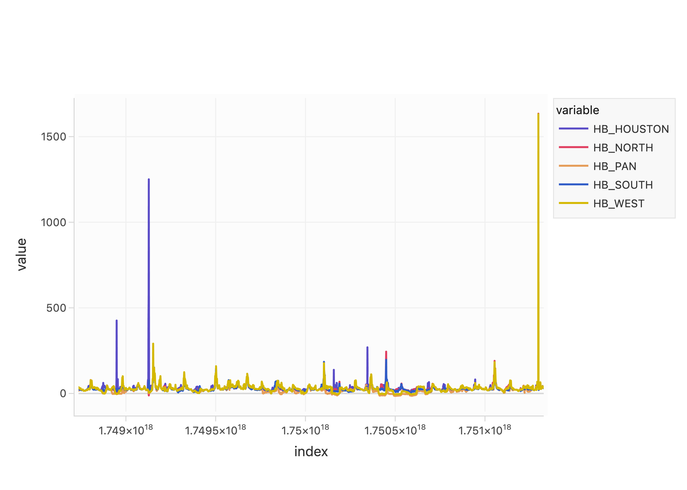
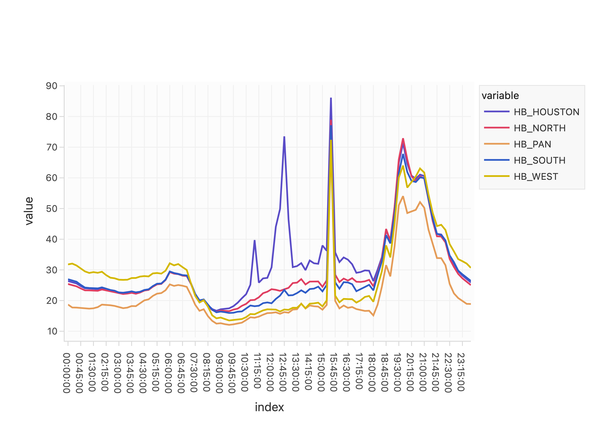

# Profiles

A useful operation in our analyses is to "profile" time-series data. This
involves taking a long time series, slicing it up into a number of individual
series that are shorter in length, and then aligning them at their start
dates.

The `profiles` module provides an interface to simplify that process.

The top-level exports are a `profile` method and a `ProfiledFrame` object that's
a thin `pandas.DataFrame` wrapper with a couple extra abilities. By "wrapper"
it's meant that you can basically treat it exactly like a `pandas.DataFrame`,
with a couple of exceptions discussed below.

## An Example

Suppose we want to know what energy prices were like in ERCOT in June 2025. We
might do that by restricting our attention to the hubs in the system, and
looking at the "typical" day. Here's some code to do that:
```python
import motoro as mt # `pandas.read_*` methods are re-exported

df = mt.read_csv("path/to/spp/data.csv", index_col=0, parse_dates=True)
pf = mt.profile(df, freq="1d", window="1d").mean()
```
These data look like the following:
```
                     HB_HOUSTON  HB_NORTH  HB_PAN  HB_SOUTH  HB_WEST
2025-06-01 00:00:00       26.19     24.69   16.37     27.54    30.93
2025-06-01 00:15:00       29.00     26.86   15.69     30.97    36.50
2025-06-01 00:30:00       27.79     26.93   22.92     28.59    31.22
2025-06-01 00:45:00       24.33     24.84   27.13     24.00    29.76
2025-06-01 01:00:00       24.55     25.26   28.44     24.09    32.02
...                         ...       ...     ...       ...      ...
2025-06-30 22:45:00       33.71     33.59   34.10     33.14    34.65
2025-06-30 23:00:00       35.45     34.13   34.43     31.91    34.87
2025-06-30 23:15:00       31.57     31.58   32.24     31.25    32.94
2025-06-30 23:30:00       30.74     30.77   31.52     30.41    32.32
2025-06-30 23:45:00       35.89     35.91   36.39     35.69    36.90

[2872 rows x 5 columns]
```

and

```
ProfiledFrame(shape=(96, 5))
          HB_HOUSTON   HB_NORTH     HB_PAN   HB_SOUTH    HB_WEST
00:00:00   26.366333  25.397333  18.695000  26.953333  31.793000
00:15:00   25.990667  25.001333  17.741333  26.628333  32.049333
00:30:00   25.575000  24.638667  17.711333  26.149667  31.438667
00:45:00   24.721333  23.950000  17.566333  25.130000  30.428000
01:00:00   24.004667  23.329333  17.329000  24.234000  29.505333
...              ...        ...        ...        ...        ...
22:45:00   31.999333  30.955333  22.341667  32.518333  36.033667
23:00:00   29.602333  28.696000  20.828333  29.764333  33.516333
23:15:00   28.161000  27.255000  19.766000  28.550333  32.835000
23:30:00   26.976000  26.038333  18.934333  27.486667  32.059333
23:45:00   25.906000  25.039667  18.880333  26.401667  30.664333

[96 rows x 5 columns]
```

When plotted, we see how profiling data can give us greater insight to the
price dynamics:



and



## The `profile` method

The `profile` function is the main entry point for creating time-aligned
perspectives from your data. It returns a `ProfiledFrame`.

### Basic Usage

```python
import motoro as mt

# load your time series data (must have DatetimeIndex)
data = mt.read_csv("path/to/data.csv", index_col=0, parse_dates=True)

# create daily profiles
pf = mt.profile(data, freq="1D", window="1D")
```

### Parameters

- **`data`**: `pd.Series` or `pd.DataFrame` with a `DatetimeIndex`
- **`freq`**: Frequency for auto-generating start dates (e.g., `"1D"`, `"2H"`,
    `"30min"`)
- **`window`**: Duration of each window (e.g., `"1D"`, `"6H"`, `"30min"`)
- **`starts`**: Explicit list of start timestamps (alternative to `freq`)
- **`ends`**: Explicit list of end timestamps (alternative to `window`)
- **`rename`**: Column naming strategy (see [Column Naming](#column-naming))
- **`absolute_index`**: Use absolute (`True`) or relative (`False`) time indexing
- **`profile_first`**: Controls column ordering for DataFrame inputs

### Examples

#### Auto-generated Daily Profiles
```python
# generate daily windows starting every day
pf = mt.profile(data, freq="1D", window="1D")

# generate overlapping 6-hour windows every 2 hours  
pf = mt.profile(data, freq="2H", window="6H")
```

#### Explicit Start Dates
```python
# specific analysis periods
starts = ["2025-01-01", "2025-01-15", "2025-02-01"]
pf = mt.profile(data, starts=starts, window="1D")

# custom end times
ends = ["2025-01-01 18:00", "2025-01-15 18:00", "2025-02-01 18:00"]
pf = mt.profile(data, starts=starts, ends=ends)
```

#### DataFrame Profiling

If the input data has multiple columns, then each of those are profiled
separately. The underlying data of the returned `ProfiledFrame` has a
MultiIndex set of columns.
```python
# profile multi-column data (e.g., multiple price nodes)
df = pd.DataFrame({
    "HB_HOUSTON": houston_prices,
    "HB_NORTH": north_prices
})

pf = mt.profile(df, freq="1D", window="1D")
# Result has MultiIndex columns: (variable, profile)
```

## The `ProfiledFrame` Object

`ProfiledFrame` wraps the profiled data and provides enhanced functionality
while maintaining full pandas compatibility.

### Key Features

1. **Pandas Compatibility**: Use like a regular DataFrame
2. **Smart Aggregations**: Automatic variable-level aggregation for MultiIndex
    columns
3. **Alignment Methods**: Realign perspectives using different strategies
4. **Smart Indexing**: Automatic time-of-day formatting for daily windows

### Properties

- **`.df`**: Access the underlying pandas DataFrame
- **`.is_absolute`**: Check if using absolute time indexing
- **`.is_relative`**: Check if using relative time indexing

### Smart Aggregations

For any profiled data, aggregation methods compute the typical pattern
across all profiles. For MultiIndex columns, this is done per variable.
To access pandas default aggregation behavior, use `pf.df.mean()` instead.

```python
# profile data with multiple nodes
pf = mt.profile(df, freq="1D", window="1D")

# get average price profile for each node:
#   For each period in the profiling window, compute the average price for
#   each node
avg_prices = pf.mean()

# get peak price for each node at each period of the profiling window
peak_prices = pf.max()

# standard deviation of prices at each period for each node
price_volatility = pf.std()
```

**Affected methods**: `mean`, `sum`, `max`, `min`, `std`, `var`, `median`,
`quantile`, `count`, `nunique`, `first`, `last`

**To use pandas default behavior**: Use `pf.df.mean()` instead of `pf.mean()`

### Alignment Methods

Realign your profiles using different reference points:

```python
# align by maximum value (e.g., peak demand)
peak_aligned = pf.align("max")

# align by minimum value (e.g., lowest prices)
trough_aligned = pf.align("min")

# align by end times
end_aligned = pf.align("end")

# custom alignment points
custom_aligned = pf.align([timestamp1, timestamp2, timestamp3])
```

After alignment, the index becomes a `TimedeltaIndex` showing time relative
to the alignment point.

## Column Naming

Control how perspective columns are named using the `rename` parameter:

### String Formatting
```python
# use strftime patterns
pf = mt.profile(data, freq="1D", window="1D", rename="%Y-%m-%d")
# Columns: "2025-01-01", "2025-01-02", etc.

pf = mt.profile(data, freq="1D", window="1D", rename="%b_%d")  
# Columns: "Jan_01", "Jan_02", etc.
```

### Custom Functions
```python
# Custom naming function
def custom_name(timestamp):
    return f"Week_{timestamp.isocalendar().week}"

pf = mt.profile(data, freq="1W", window="1W", rename=custom_name)
# Columns: "Week_1", "Week_2", etc.
```

### Default Naming
```python
# Auto-generated names
pf = mt.profile(data, freq="1D", window="1D")
# Columns: "profile_0", "profile_1", etc.
```

If the input data has multiple columns, those column labels are preserved in
the MultiIndex.

## Index Types

### Absolute Indexing (Default)
```python
pf = mt.profile(data, freq="1D", window="1D", absolute_index=True)
# Index: actual timestamps starting from first profile"s start date
```

### Relative Indexing
```python
pf = mt.profile(data, freq="1D", window="1D", absolute_index=False)  
# Index: TimedeltaIndex (00:00:00, 00:15:00, 00:30:00, ...)
```

### Smart Indexing
For daily windows (`window="1D"`), the module automatically converts absolute
timestamps to time-of-day format when the data spans exactly one day:

```python
pf = mt.profile(data, freq="1D", window="1D")
# Index automatically becomes: 00:00:00, 00:15:00, ..., 23:45:00
```

## Common Use Cases

### Daily Load Profiling
```python
# Analyze daily load patterns
load_profiles = mt.profile(load_data, freq="1D", window="1D", rename="%m/%d")
avg_daily_load = load_profiles.mean()
peak_load_times = load_profiles.idxmax()
```

### Price Volatility Analysis  
```python
# Compare price patterns across multiple nodes
price_profiles = mt.profile(price_data, freq="1D", window="1D")
price_volatility = price_profiles.std()
correlation_matrix = price_profiles.corr()
```

### Event Analysis
```python
# Analyze specific high-demand periods
event_dates = ["2025-01-15", "2025-02-20", "2025-08-15"]  # Heat wave days
event_profiles = mt.profile(data, starts=event_dates, window="1D")
avg_event_pattern = event_profiles.mean()
```

### Peak Hour Alignment
```python
# Align all days by their peak demand hour
daily_profiles = mt.profile(load_data, freq="1D", window="1D")
peak_aligned = daily_profiles.align("max")
# Now t=0 corresponds to peak hour for each day
```

### Working with Results

#### Accessing Specific Variables
```python
# For MultiIndex columns
houston_profiles = pf["HB_HOUSTON"] # All Houston profiles
north_profiles = pf["HB_NORTH"]     # All North profiles

# Specific profile for specific variable
jan_1_houston = pf[("HB_HOUSTON", "2025-01-01")]
```

#### Statistical Analysis
```python
# Cross-day statistics
daily_means = pf.mean()           # Average pattern per variable
daily_peaks = pf.max()            # Peak values per variable  
daily_volatility = pf.std()       # Volatility per variable

# Cross-variable statistics (use .df for pandas behavior)
hourly_averages = pf.df.mean(axis=1)  # Average across all variables per hour
```

#### Visualization

Since `ProfiledFrame` is a thin wrapper for `pandas.DataFrame`, all the usual
plotting methods work as you'd expect: `pf.plot().show()` will generate a line
plot for each perspective in the profile.

## Advanced Usage

### Chained Operations
```python
# ProfiledFrame preserves type through pandas operations
hourly_averages = pf.resample("1H").mean() # Still a ProfiledFrame
smoothed = pf.rolling(4).mean()            # Still a ProfiledFrame  
```

### Custom Aggregations
```python
# Define domain-specific metrics
def load_factor(profiles):
    """Calculate load factor (average/peak ratio)"""
    return profiles.mean() / profiles.max()

# Apply to profiled data
load_factors = load_factor(pf.df)  # Use .df for custom functions
```

## Best Practices

1. **Data Preparation**: Ensure your data has a proper `DatetimeIndex`
2. **Naming**: Use descriptive `rename` patterns for easier analysis
3. **Alignment**: Choose alignment strategy based on your analysis goals
4. **Aggregation**: Use `pf.method()` for within-variable aggregation,
    `pf.df.method()` for pandas default behavior

## Troubleshooting

### Common Errors

**TypeError: profiling data must have a DatetimeIndex**
```python
# fix: Ensure proper datetime index
data.index = pd.to_datetime(data.index)
```

**ValueError: must specify exactly one of "freq" or "starts"**
```python
# fix: Use either freq OR starts, not both
pf = mt.profile(data, freq="1D", window="1D")  # OR
pf = mt.profile(data, starts=["2025-01-01"], window="1D")
```

**ValueError: length mismatch**
```python
# fix: Ensure starts/ends or window lists have matching lengths
starts = ["2025-01-01", "2025-01-02"]
windows = ["1D", "1D"]  # Must match length of starts
```
